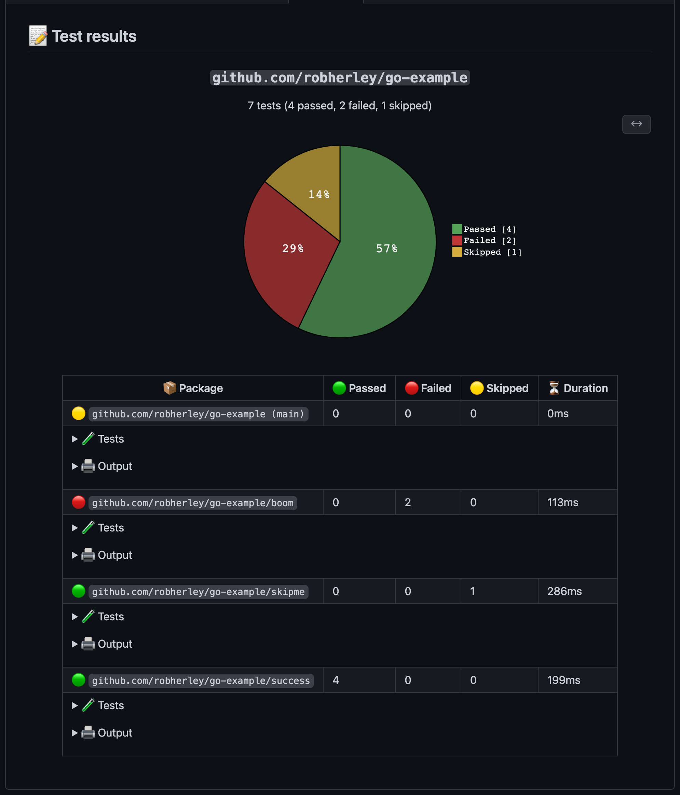
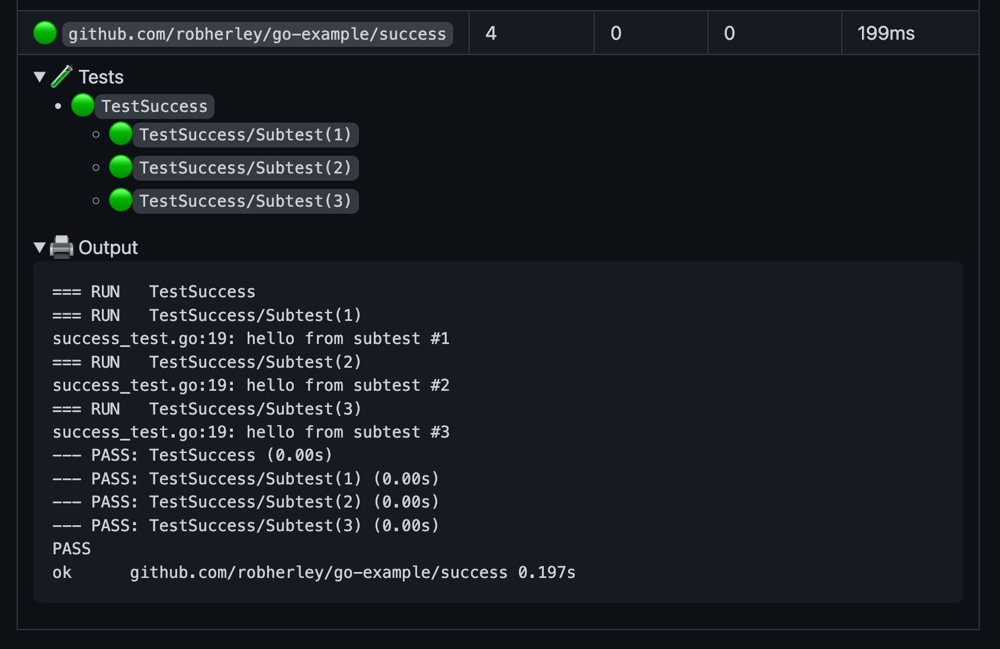

# go-test-action

GitHub Action for running `go test ...` and getting rich summary and annotations as output.

Powered by [Job Summaries](https://github.blog/2022-05-09-supercharging-github-actions-with-job-summaries/), this Action will generate a convenient interactive viewer for tests based on Go's [test2json](https://pkg.go.dev/cmd/test2json) output. If there are any errors during `go test`, the Action will report back the same exit code, which will fail the job.

## Demo

To interact with an example, [check it out here](https://github.com/robherley/go-test-example/actions/runs/2647255176/attempts/1).

Tests are organized per package, with a brief summary of individual test results:



Expand for per-test (with subtest) results and to view raw test output:



## Inputs

- `moduleDirectory` (optional): relative path to the directory containing the `go.mod` of the module you wish to test
  - Default: `.`
- `testArguments` (optional): arguments to pass to `go test`, `-json` will be prepended automatically
  - Default: `./...`

## Example workflow

```yaml
name: Go

on:
  push:

jobs:
  test:
    runs-on: ubuntu-latest
    steps:
    - uses: actions/checkout@v3

    - name: Set up Go
      uses: actions/setup-go@v3
      with:
        go-version: 1.18

    - name: Build
      run: go build -v ./...

    - name: Test
      uses: robherley/go-test-action@v0.0.1
```

