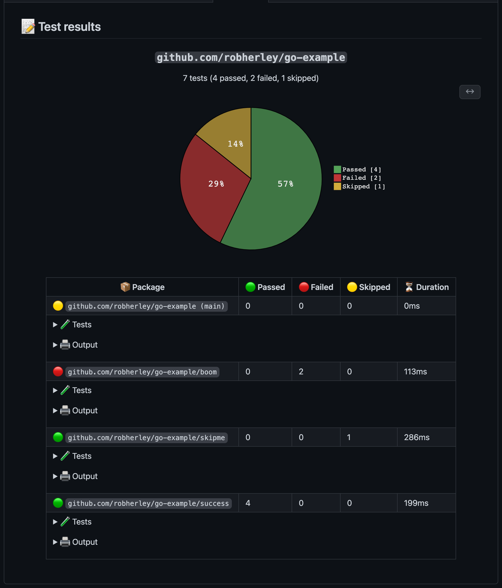
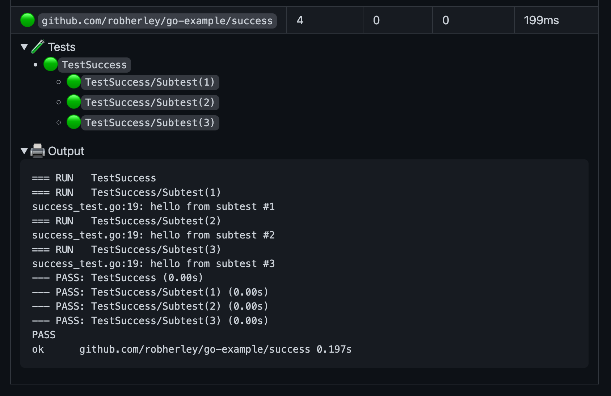

# go-test-action

- [go-test-action](#go-test-action)
  - [Quick start](#quick-start)
  - [Inputs](#inputs)
  - [Screenshots](#screenshots)
  - [Examples](#examples)
    - [Basic](#basic)
    - [Coverage](#coverage)
    - [Using existing test files](#using-existing-test-files)
    - [Omitting elements](#omitting-elements)

GitHub Action for running `go test ./...` and getting rich summary and annotations as output.

Powered by [Job Summaries](https://github.blog/2022-05-09-supercharging-github-actions-with-job-summaries/), this Action will generate a convenient interactive viewer for tests based on Go's [test2json](https://pkg.go.dev/cmd/test2json) output. If there are any errors during `go test`, the Action will report back the same exit code, which will fail the job.

## Quick start

```yaml
- name: Test
  uses: robherley/go-test-action@v1
```

## Inputs

```yaml
- uses: robherley/go-test-action@v1
  with:
    # Relative path to the directory containing the go.mod of the module you wish to test.
    # Optional. Default is '.'
    moduleDirectory:

    # Arguments to pass to go test, -json will be prepended automatically.
    # Optional. Default is './...'
    testArguments:

    # If true, appends `-cover` to the go test command. Skipped if testArguments
    # already contains a -cover* flag (e.g. -coverprofile=...). Coverage is rendered
    # as a column in the summary table.
    # Optional. Default is 'false'
    cover:

    # Parse one or more [test2json](https://pkg.go.dev/cmd/test2json) files (newline-separated) and generate a combined summary.
    # Will always exit(0) on successful test file parse.
    # fromJSONFile is accepted as an alias for a single file.
    # Optional. No default
    fromJSONFiles:

    # Whitespace separated list of renderable items to omit.
    # Valid options to omit are:
    #  untested: packages that have no tests
    #  successful: packages that are successful
    #  pie: mermaid.js pie chart
    #  pkg-tests: per-package test list
    #  pkg-output: per-package test output
    #  stderr: standard error output of `go test` subprocess
    # Optional. No default
    omit:
```

## Screenshots

Tests are organized per package, with a brief summary of individual test results:



Expand for per-test (with subtest) results and to view raw test output:



## Examples

### Basic

```yaml
name: Go

on:
  push:

jobs:
  test:
    runs-on: ubuntu-latest
    steps:
    - uses: actions/checkout@v4

    - name: Set up Go
      uses: actions/setup-go@v5
      with:
        go-version-file: go.mod

    - name: Build
      run: go build -v ./...

    - name: Test
      uses: robherley/go-test-action@v1
```

### Coverage

When `go test` is invoked with `-cover` (or `-coverprofile=...`), the action parses the per-package `coverage: X.Y% of statements` lines and appends a 📊 Coverage column to the summary table, plus the mean coverage to the header text.

Use the `cover` input as a shortcut to append `-cover`:

```yaml
- name: Test
  uses: robherley/go-test-action@v1
  with:
    cover: true
```

Or pass a coverage flag directly via `testArguments`:

```yaml
- name: Test
  uses: robherley/go-test-action@v1
  with:
    testArguments: '-coverprofile=coverage.out ./...'
```

### Using existing test files

```yaml
- name: Test
  uses: robherley/go-test-action@v1
  with:
    fromJSONFiles: |
      /path/to/pkg1-test2json.json
      /path/to/pkg2-test2json.json
```

### Omitting elements

See [Inputs](#inputs) above for valid options

```yaml
- name: Test
  uses: robherley/go-test-action@v1
  with:
    omit: |
      pie
      stderr
```

or

```yaml
- name: Test
  uses: robherley/go-test-action@v1
  with:
    omit: 'pie'
```
