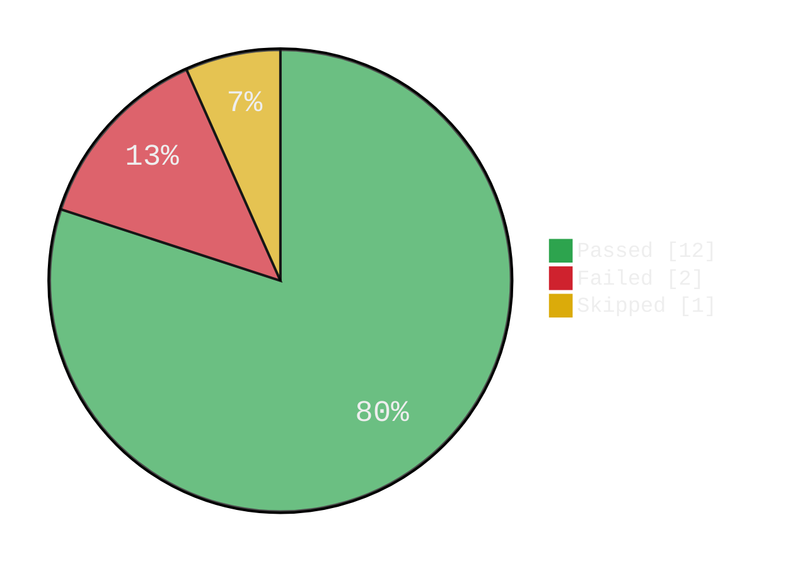

# go-test-action

- [go-test-action](#go-test-action)
  - [Quick start](#quick-start)
  - [Inputs](#inputs)
  - [Demo](#demo)
  - [Examples](#examples)
    - [Basic](#basic)
    - [Coverage](#coverage)
    - [Using existing test files](#using-existing-test-files)
    - [Omitting elements](#omitting-elements)

GitHub Action for running `go test ./...` and getting rich summary and annotations as output.

Powered by [Job Summaries](https://github.blog/2022-05-09-supercharging-github-actions-with-job-summaries/), this Action will generate a convenient interactive viewer for tests based on Go's [test2json](https://pkg.go.dev/cmd/test2json) output. If there are any errors during `go test`, the Action will report back the same exit code, which will fail the job.

## Quick start

```yaml
- name: Test
  uses: robherley/go-test-action@v1
```

## Inputs

```yaml
- uses: robherley/go-test-action@v1
  with:
    # Relative path to the directory containing the go.mod of the module you wish to test.
    # Optional. Default is '.'
    moduleDirectory:

    # Arguments to pass to go test, -json will be prepended automatically.
    # Optional. Default is './...'
    testArguments:

    # If true, appends `-cover` to the go test command. Skipped if testArguments
    # already contains a -cover* flag (e.g. -coverprofile=...). Coverage is rendered
    # as a column in the summary table.
    # Optional. Default is 'false'
    cover:

    # Parse one or more [test2json](https://pkg.go.dev/cmd/test2json) files (newline-separated) and generate a combined summary.
    # Will always exit(0) on successful test file parse.
    # fromJSONFile is accepted as an alias for a single file.
    # Optional. No default
    fromJSONFiles:

    # Whitespace separated list of renderable items to omit.
    # Valid options to omit are:
    #  untested: packages that have no tests
    #  successful: packages that are successful
    #  pie: mermaid.js pie chart
    #  pkg-tests: per-package test list
    #  pkg-output: per-package test output
    #  stderr: standard error output of `go test` subprocess
    # Optional. No default
    omit:
```

## Demo

Here's a rendered output (with coverage) from [`robherley/go-test-example`](https://github.com/robherley/go-test-example):

<details><summary>🖼️ Demo Test Summary</summary>

<h2>📝 Test results</h2>
<div align="center"><h3><code>github.com/robherley/go-test-example</code></h3>15 tests (12 passed, 2 failed, 1 skipped)<br><code>█████░░░░░</code> 53.1% coverage


```mermaid
%%{init: {"theme":"base","themeVariables":{"fontFamily":"monospace","pieSectionTextSize":"24px","darkMode":true,"pie1":"#2da44e","pie2":"#cf222e","pie3":"#dbab0a"}}}%%
pie showData
"Passed" : 12
"Failed" : 2
"Skipped" : 1

```

</div><table align="center"><tr><th>📦 Package</th><th>🟢 Passed</th><th>🔴 Failed</th><th>🟡 Skipped</th><th>⏳ Duration</th><th colspan="2">📊 Coverage</th></tr><tr><td>🟡 <code>. (main)</code></td><td>0</td><td>0</td><td>0</td><td>0ms</td><td colspan="2">—</td></tr><tr><td colspan="7"><details><summary>🧪 Tests</summary>(none)</details><details><summary>🖨️ Output</summary><pre><code>(none)</code></pre></details></td></tr><tr><td>🔴 <code>boom</code></td><td>0</td><td>2</td><td>0</td><td>6ms</td><td colspan="2">—</td></tr><tr><td colspan="7"><details><summary>🧪 Tests</summary><ul><li>🔴<code>TestFatal</code></li><li>🔴<code>TestPanic</code></li></ul></details><details><summary>🖨️ Output</summary><pre><code>=== RUN   TestFatal
    boom_test.go:6: this was a failure
--- FAIL: TestFatal (0.00s)
=== RUN   TestPanic
--- FAIL: TestPanic (0.00s)
panic: this was a panic [recovered]
	panic: this was a panic

goroutine 19 [running]:
testing.tRunner.func1.2({0x4fde60, 0x549ed8})
	/opt/hostedtoolcache/go/1.18.10/x64/src/testing/testing.go:1389 +0x24e
testing.tRunner.func1()
	/opt/hostedtoolcache/go/1.18.10/x64/src/testing/testing.go:1392 +0x39f
panic({0x4fde60, 0x549ed8})
	/opt/hostedtoolcache/go/1.18.10/x64/src/runtime/panic.go:838 +0x207
github.com/robherley/go-test-example/boom_test.TestPanic(0x0?)
	/home/runner/work/go-test-example/go-test-example/boom/boom_test.go:10 +0x27
testing.tRunner(0xc0000836c0, 0x529288)
	/opt/hostedtoolcache/go/1.18.10/x64/src/testing/testing.go:1439 +0x102
created by testing.(*T).Run
	/opt/hostedtoolcache/go/1.18.10/x64/src/testing/testing.go:1486 +0x35f
</code></pre></details></td></tr><tr><td>🟢 <code>highcov</code></td><td>7</td><td>0</td><td>0</td><td>4ms</td><td>100%</td><td><code>██████████</code></td></tr><tr><td colspan="7"><details><summary>🧪 Tests</summary><ul><li>🟢<code>TestAdd</code></li><li>🟢<code>TestDiv</code></li><li>🟢<code>TestFizzBuzz</code></li><li>🟢<code>TestMul</code></li><li>🟢<code>TestReverse</code></li><li>🟢<code>TestShout</code></li><li>🟢<code>TestSub</code></li></ul></details><details><summary>🖨️ Output</summary><pre><code>=== RUN   TestAdd
--- PASS: TestAdd (0.00s)
=== RUN   TestSub
--- PASS: TestSub (0.00s)
=== RUN   TestMul
--- PASS: TestMul (0.00s)
=== RUN   TestDiv
--- PASS: TestDiv (0.00s)
=== RUN   TestReverse
--- PASS: TestReverse (0.00s)
=== RUN   TestShout
--- PASS: TestShout (0.00s)
=== RUN   TestFizzBuzz
--- PASS: TestFizzBuzz (0.00s)
</code></pre></details></td></tr><tr><td>🟢 <code>lowcov</code></td><td>1</td><td>0</td><td>0</td><td>4ms</td><td>6.2%</td><td><code>█░░░░░░░░░</code></td></tr><tr><td colspan="7"><details><summary>🧪 Tests</summary><ul><li>🟢<code>TestAdd</code></li></ul></details><details><summary>🖨️ Output</summary><pre><code>=== RUN   TestAdd
--- PASS: TestAdd (0.00s)
</code></pre></details></td></tr><tr><td>🟢 <code>skipme</code></td><td>0</td><td>0</td><td>1</td><td>3ms</td><td colspan="2">—</td></tr><tr><td colspan="7"><details><summary>🧪 Tests</summary><ul><li>🟡<code>TestSkip</code></li></ul></details><details><summary>🖨️ Output</summary><pre><code>=== RUN   TestSkip
    skipme_test.go:6: skip me
--- SKIP: TestSkip (0.00s)
</code></pre></details></td></tr><tr><td>🟢 <code>success</code></td><td>4</td><td>0</td><td>0</td><td>2ms</td><td colspan="2">—</td></tr><tr><td colspan="7"><details><summary>🧪 Tests</summary><ul><li>🟢<code>TestSuccess</code></li><ul><li>🟢<code>TestSuccess/Subtest(1)</code></li><li>🟢<code>TestSuccess/Subtest(2)</code></li><li>🟢<code>TestSuccess/Subtest(3)</code></li></ul></ul></details><details><summary>🖨️ Output</summary><pre><code>=== RUN   TestSuccess
=== RUN   TestSuccess/Subtest(1)
    success_test.go:19: hello from subtest #1
=== RUN   TestSuccess/Subtest(2)
    success_test.go:19: hello from subtest #2
=== RUN   TestSuccess/Subtest(3)
    success_test.go:19: hello from subtest #3
--- PASS: TestSuccess (0.00s)
    --- PASS: TestSuccess/Subtest(1) (0.00s)
    --- PASS: TestSuccess/Subtest(2) (0.00s)
    --- PASS: TestSuccess/Subtest(3) (0.00s)
</code></pre></details></td></tr></table>

</details>

## Examples

### Basic

```yaml
name: Go

on:
  push:

jobs:
  test:
    runs-on: ubuntu-latest
    steps:
    - uses: actions/checkout@v4

    - name: Set up Go
      uses: actions/setup-go@v5
      with:
        go-version-file: go.mod

    - name: Build
      run: go build -v ./...

    - name: Test
      uses: robherley/go-test-action@v1
```

### Coverage

When `go test` is invoked with `-cover` (or `-coverprofile=...`), the action parses the per-package `coverage: X.Y% of statements` lines and appends a 📊 Coverage column to the summary table, plus the mean coverage to the header text.

Use the `cover` input as a shortcut to append `-cover`:

```yaml
- name: Test
  uses: robherley/go-test-action@v1
  with:
    cover: true
```

Or pass a coverage flag directly via `testArguments`:

```yaml
- name: Test
  uses: robherley/go-test-action@v1
  with:
    testArguments: '-coverprofile=coverage.out ./...'
```

### Using existing test files

```yaml
- name: Test
  uses: robherley/go-test-action@v1
  with:
    fromJSONFiles: |
      /path/to/pkg1-test2json.json
      /path/to/pkg2-test2json.json
```

### Omitting elements

See [Inputs](#inputs) above for valid options

```yaml
- name: Test
  uses: robherley/go-test-action@v1
  with:
    omit: |
      pie
      stderr
```

or

```yaml
- name: Test
  uses: robherley/go-test-action@v1
  with:
    omit: 'pie'
```
